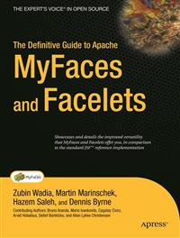

# Apress Source Code

This repository accompanies [*The Definitive Guide to Apache MyFaces and Facelets*](http://www.apress.com/9781590597378) by Martin Marinschek, Zubin Wadia, Hazem Saleh, and Dennis Byrne (Apress, 2008).

Download the files as a zip using the green button, or clone the repository to your machine using Git.

## Releases

Release v1.0 corresponds to the code in the published book, without corrections or updates.

## Contributions

See the file Contributing.md for more information on how you can contribute to this repository.
